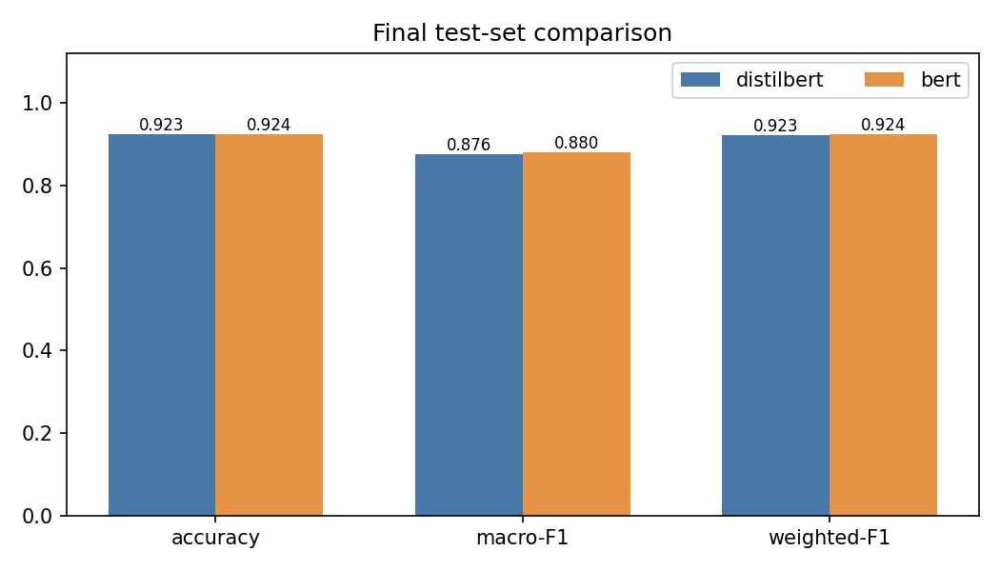

# Tweet Emotion Classification — Fine-tuning DistilBERT vs BERT

Final project for my Text Analytics / NLP course. The task: classify English tweets
into six emotions (sadness, joy, love, anger, fear, surprise) by fine-tuning
pre-trained language models, with a proper hyperparameter tuning experiment and a
comparison between two models.

**Full write-up:** [`report/report.pdf`](report/report.pdf) — dataset, preprocessing,
hyperparameter justifications, results and analysis.

## What's in here

```
├── run_experiments.sh        # one-command launcher (venv + install + train + figures)
├── requirements.txt
├── src/
│   ├── run_experiments.py    # the whole experiment suite (10 fine-tuning runs)
│   └── make_figures.py       # builds every figure from the logged results
├── notebooks/
│   └── colab_run.ipynb       # same thing as a Colab notebook — Runtime > Run all
├── data/                     # CSV copies of the exact splits used
├── results/
│   ├── experiments.json      # every run: config + per-epoch metrics
│   ├── test_results.json     # final test-set comparison
│   ├── dataset_stats.json    # sizes, class counts, token-length percentiles
│   └── figures/              # confusion matrices, tuning curves, comparisons
└── report/                   # project report (md + pdf)
```

## How to run

**Option 1 — Google Colab (easiest):** open
[`notebooks/colab_run.ipynb`](notebooks/colab_run.ipynb) in Colab, pick a GPU runtime,
Runtime → Run all. It clones this repo, installs dependencies, runs all ten
experiments (~30–45 min on a T4) and displays the results and figures at the end.

**Option 2 — locally:**

```bash
git clone https://github.com/mo7morad/tweet-emotion-classification.git
cd tweet-emotion-classification
bash run_experiments.sh
```

The script creates a `.venv`, installs `requirements.txt`, runs everything and writes
all metrics/figures into `results/`. Works on CUDA, Apple Silicon (MPS) or plain CPU —
device is auto-detected. Interrupted? Run it again; finished experiments are skipped.

Quick sanity run instead of the full suite (~3 min):

```bash
QUICK=1 python src/run_experiments.py
```

## The experiments

| Stage | What it tests | Runs |
|---|---|---|
| A | learning rate: 2e-5 / 3e-5 / 5e-5 (DistilBERT) | 3 |
| B | batch size: 16 vs 32, at the best LR | 1 |
| C | 5-epoch run to watch overfitting | 1 |
| D | class-weighted loss vs plain loss (imbalance handling) | 1 |
| E | BERT-base at the best config + one alternative LR | 2 |
| F | final run per model → single test-set evaluation each | 2 |

Model selection metric is **macro-F1** (the dataset is imbalanced — `surprise` has ~9x
fewer examples than `joy`, so accuracy alone is misleading).

## Results

Headline numbers (test set, single evaluation per final model):

| | DistilBERT | BERT-base |
|---|---|---|
| Best config | lr 5e-5, batch 16, epoch 2 | lr 2e-5, batch 16, epoch 4 |
| Test accuracy | 0.9230 | **0.9245** |
| Test macro-F1 | 0.8756 | **0.8804** |
| Fine-tuning time | 7.4 min | 13.8 min |

Findings worth reading the report for: the best learning rate contradicted the usual
2e-5 default *and differed between the two models* (DistilBERT wanted 5e-5, BERT
wanted 2e-5); everything past epoch 2–3 was overfitting; class-weighted loss helped
the rarest class but hurt overall; and DistilBERT delivered ~99.5% of BERT's
performance at half the training cost.



## Dataset

[dair-ai/emotion](https://huggingface.co/datasets/dair-ai/emotion) — English tweets,
6 emotion classes. I use a stratified 8,000-tweet subsample of the official training
split (to keep 10 fine-tuning runs affordable) and the official validation/test splits
in full (2,000 each). Exact splits are saved as CSVs in `data/`.
