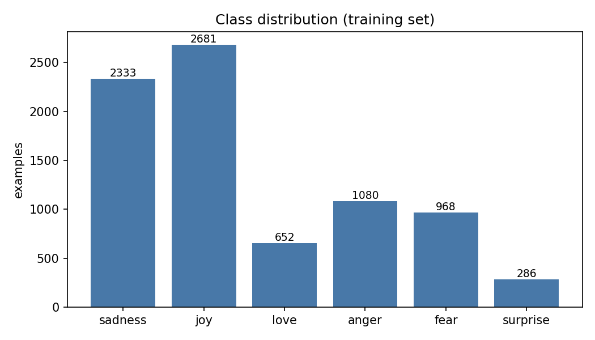
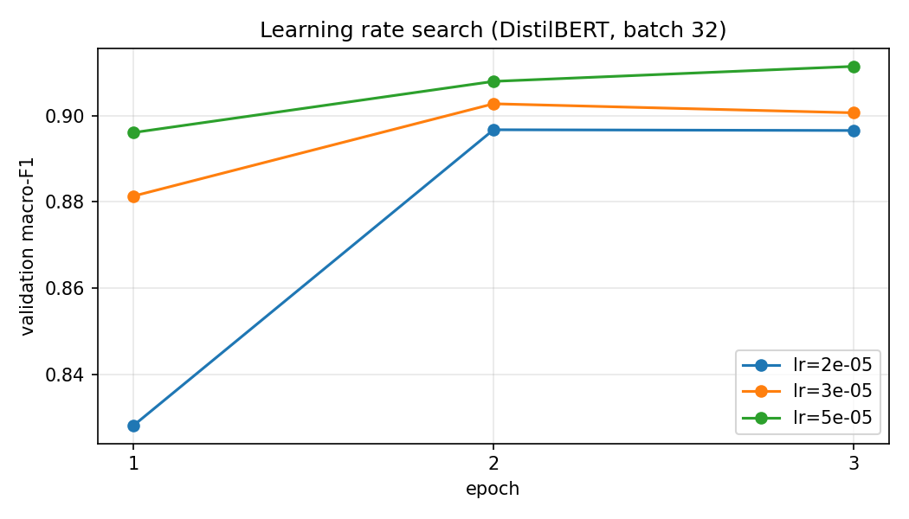
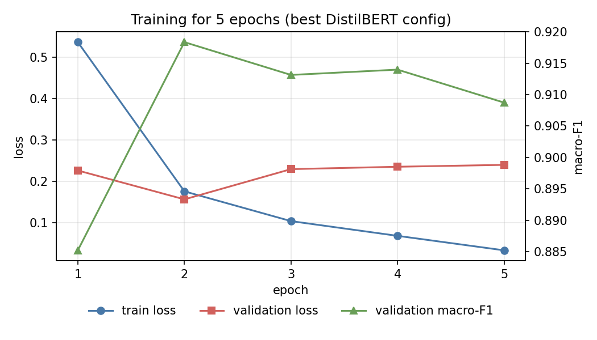
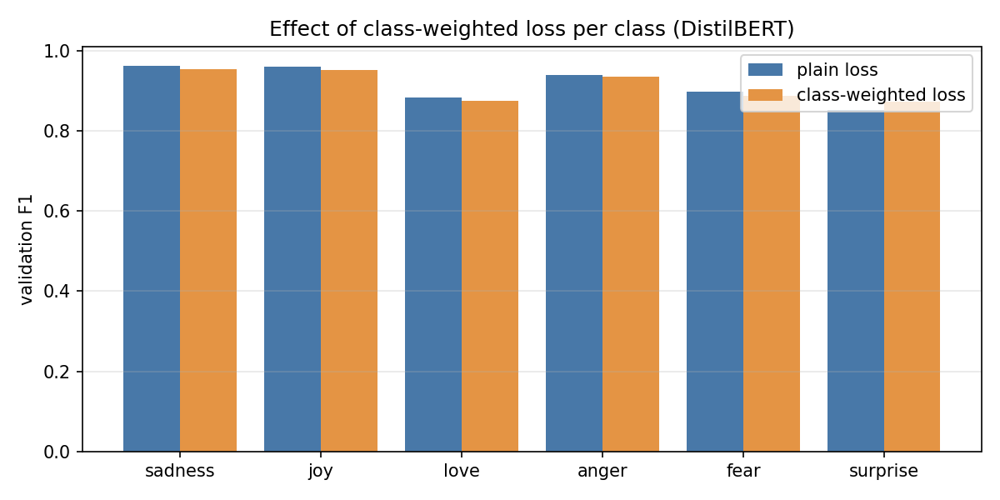
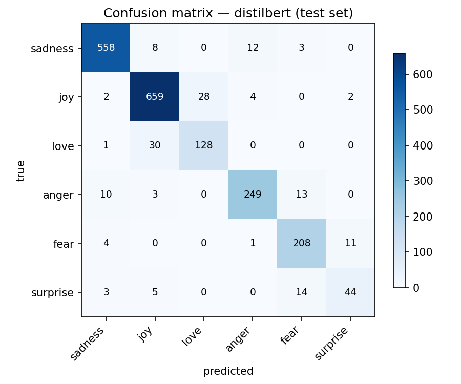

# Emotion Classification by Fine-tuning Pre-trained Language Models

**Final Project — Text Analytics / NLP Course**

Mohamed Morad (Moe) — Computer Science, Universitas Islam Indonesia — July 2026

Repository: https://github.com/mo7morad/tweet-emotion-classification

---

## 1. Introduction

For this project I picked text classification, specifically emotion detection on
short social media texts. Sentiment analysis felt a bit too safe (positive/negative
is basically a coin flip with extra steps), so I went with a 6-class emotion problem
instead: sadness, joy, love, anger, fear and surprise. Emotions overlap in messy ways —
"love" is often just a specific kind of "joy" — which makes the task harder and the
model comparison more interesting.

The goals follow the assignment directly:

1. understand the fine-tuning process of pre-trained transformers,
2. run a proper hyperparameter tuning experiment (learning rate, batch size, epochs),
3. evaluate model performance with metrics that respect class imbalance,
4. compare two pre-trained language models under the same conditions.

The two models I compare are **DistilBERT** (`distilbert-base-uncased`) and
**BERT-base** (`bert-base-uncased`). The point of this pairing is practical: DistilBERT
is a distilled version of BERT with roughly 40% fewer parameters, and the original
paper claims it keeps ~97% of BERT's language understanding. I wanted to check whether
that claim survives contact with my task, because if it does, the smaller model is the
obviously better choice for anything running on a budget.

## 2. Dataset

I used the **dair-ai/emotion** dataset from the Hugging Face Hub (Saravia et al., 2018,
the CARER paper). It contains English tweets labeled with one of six emotions.

| Split | Size | Notes |
|---|---|---|
| Train | 8,000 | stratified subsample of the official 16k train split |
| Validation | 2,000 | official split, untouched |
| Test | 2,000 | official split, untouched |

I subsampled the training split from 16k to 8k (stratified, so class proportions are
preserved) to keep the full experiment suite — ten fine-tuning runs — trainable in a
reasonable time on my laptop. Validation and test stay at full size so the evaluation
is as trustworthy as possible.

The class distribution is clearly imbalanced, which is one of the reasons I picked this
dataset — it lets me test imbalance handling instead of just mentioning it:

| Class | Train count | Share |
|---|---|---|
| joy | 2,681 | 33.5% |
| sadness | 2,333 | 29.2% |
| anger | 1,080 | 13.5% |
| fear | 968 | 12.1% |
| love | 652 | 8.2% |
| surprise | 286 | 3.6% |

(Exact counts are produced by the code in `results/dataset_stats.json`.)

`surprise` has roughly 9x fewer examples than `joy`. This is why plain accuracy is a
misleading metric here — a model can ignore `surprise` completely and barely feel it in
accuracy. I therefore use **macro-F1** as the main model selection metric: it averages
F1 over classes with equal weight, so the minority classes actually matter.

## 3. Preprocessing and Tokenization

Transformers come with their own subword tokenizers, and the golden rule is: use the
tokenizer that matches the checkpoint. So each model gets its own tokenizer
(WordPiece for both, but with different vocabularies — DistilBERT and BERT-base
share the same 30,522-token uncased vocab, but I still load each one from its own
checkpoint to keep the pipeline honest).

Decisions I made here, with reasons:

- **No classic text cleaning** (no stopword removal, no stemming, no lowercasing on my
  side). The dataset is already lowercased, and subword tokenizers are trained on raw
  text — "cleaning" it usually destroys information the model expects. Stemming a word
  like "loving" to "love" would literally erase the distinction between two of my classes.
- **`max_length = 64` with truncation.** I did not guess this number: the code measures
  token lengths on the training set — mean is 22 tokens, the 99th percentile is **58**
  and the longest tweet is 87 (see `results/dataset_stats.json`). So 64 covers >99% of
  tweets with almost no waste.
  Padding to 128 or 512 would only burn compute on padding tokens.
- **Dynamic padding** with `DataCollatorWithPadding` — batches are padded to the longest
  sequence in the batch, not a global constant. Cheaper and standard practice.
- **Splitting**: the dataset ships with an official train/validation/test split, which I
  respect (subsampling only the train part, stratified by label). Every tuning decision
  uses the validation set only; the test set is touched exactly twice — once per final
  model. No test-set shopping.
- **Imbalance handling**: tried explicitly as an experiment — a class-weighted
  cross-entropy loss with weights inversely proportional to class frequency
  (`sklearn`'s "balanced" scheme). Results in Section 6.

## 4. Models

| | DistilBERT | BERT-base |
|---|---|---|
| Checkpoint | `distilbert-base-uncased` | `bert-base-uncased` |
| Layers | 6 | 12 |
| Parameters | ~66M | ~110M |
| Pre-training | distilled from BERT | MLM + NSP |

Both are uncased English models, matching the (lowercased, English) dataset — this is
the "model must support the dataset language" requirement of the assignment.

A classification head (a linear layer on top of the pooled/[CLS] representation) is
initialized randomly and trained together with the encoder — this is **full
fine-tuning**: every parameter in the network is updated. I chose full fine-tuning over
LoRA because the models are small enough that it fits comfortably on consumer hardware,
and it's the baseline that parameter-efficient methods get compared against anyway.

## 5. Fine-tuning Setup

Everything is implemented with the Hugging Face `Trainer` on PyTorch
(`src/run_experiments.py`). Fixed settings across all runs:

- Optimizer: AdamW, weight decay 0.01 (the Trainer default optimizer; weight decay is
  the standard light regularizer for transformer fine-tuning)
- LR schedule: linear decay to zero, no warmup (runs are short; on 250-500 step epochs
  a warmup phase would eat a large chunk of the first epoch)
- Seed: 42, set before every run for reproducibility
- Evaluation: at the end of every epoch on the validation set (accuracy + macro-F1)
- Hardware: Apple Silicon GPU (MPS backend). The code auto-detects CUDA / MPS / CPU,
  so it runs the same on Google Colab.

The tuned hyperparameters — learning rate, batch size, number of epochs — and the
justification for each searched range are in the next section.

## 6. Hyperparameter Tuning

All tuning happens on DistilBERT (the cheaper model), on the validation set, one
knob at a time. The winning configuration is then transferred to BERT-base with one
alternative learning rate as a sanity check (Section 7). Model selection metric:
validation macro-F1.

### 6.1 Learning rate

**Searched:** 2e-5, 3e-5, 5e-5 (batch 32, 3 epochs). This is exactly the range the
original BERT paper recommends for fine-tuning. I didn't go above 5e-5 because large
rates are known to wreck the pre-trained weights early in training (the model
"forgets" its pre-training before the head learns anything), and below 2e-5
convergence in 3 epochs gets doubtful.

| Learning rate | Best val macro-F1 | Best epoch | Val accuracy |
|---|---|---|---|
| 2e-5 | 0.8967 | 2 | 0.926 |
| 3e-5 | 0.9027 | 2 | 0.929 |
| **5e-5** | **0.9114** | 3 | 0.936 |

The result surprised me a little: the common default (2e-5) was the *worst* of the
three, and the most aggressive rate won by ~1.5 macro-F1 points, consistently across
epochs. My interpretation: the inputs are short
and the random-initialized classification head needs to travel far from its starting
point — a higher rate covers that distance within the small epoch budget, and the
linear decay tames it before it can do damage.

### 6.2 Batch size

**Searched:** 16 vs 32, at the winning learning rate (5e-5), 3 epochs. These two are
the standard fine-tuning sizes from the BERT paper; they also conveniently bracket
what fits comfortably in memory on most GPUs for this sequence length.

| Batch size | Updates per epoch | Best val macro-F1 | Runtime |
|---|---|---|---|
| **16** | 500 | **0.9154** | 5.4 min |
| 32 | 250 | 0.9114 | 3.8 min |

Batch 16 wins. Smaller batches mean twice as many (noisier) weight updates per epoch,
which acts as a mild regularizer and combines well with the aggressive learning rate.
The cost is ~40% more wall-clock time — acceptable at this scale.

### 6.3 Number of epochs

**Searched:** the best config (lr 5e-5, batch 16) trained for 5 epochs, evaluating
after every epoch — one run answers "how many epochs?" for every budget up to 5:

| Epoch | Train loss | Val loss | Val macro-F1 |
|---|---|---|---|
| 1 | 0.536 | 0.226 | 0.8852 |
| **2** | 0.175 | **0.156** | **0.9183** |
| 3 | 0.103 | 0.229 | 0.9131 |
| 4 | 0.068 | 0.235 | 0.9140 |
| 5 | 0.033 | 0.239 | 0.9087 |

Textbook overfitting: training loss keeps
falling all the way to 0.03, but validation loss bottoms out at epoch 2 and climbs
after. Macro-F1 peaks at epoch 2 and drifts down. Conclusion: the useful budget is
2–4 epochs; the final runs train 4 epochs and keep the checkpoint of the best epoch
by validation macro-F1 (early-stopping style), which protects against landing on an
unlucky final epoch.

### 6.4 Handling class imbalance: weighted loss

Since `surprise` has ~9x fewer examples than `joy`, I compared plain cross-entropy
against a class-weighted version (weights = inverse class frequency, sklearn's
"balanced" scheme) at the best config:

| Class | Plain loss F1 | Weighted loss F1 |
|---|---|---|
| sadness | 0.962 | 0.953 |
| joy | 0.960 | 0.951 |
| love | 0.883 | 0.875 |
| anger | 0.939 | 0.934 |
| fear | 0.897 | 0.888 |
| surprise | 0.852 | **0.873** |
| **macro-F1 (best epoch)** | **0.9154** | 0.9124 |

The weighted loss did exactly what it promises — `surprise` gained 2 F1 points — but
it paid for that with small losses on every other class, and the overall macro-F1
ended up slightly *worse*. So I did not adopt it for the final models. The honest
summary: at this level of imbalance (which is real but not extreme), a strong
pre-trained model with a macro-F1 selection metric already treats minority classes
reasonably; re-weighting shifted the balance rather than improving it.

## 7. Final Results

Final protocol: each model trains with its own best configuration for 4 epochs, the
best epoch is selected by validation macro-F1 (BERT ended up using all 4; DistilBERT
peaked at epoch 2), and the resulting model is evaluated **once** on the test set.

An interesting detail before the numbers: the two models disagreed about the learning
rate. DistilBERT clearly preferred the aggressive 5e-5, but on BERT-base 5e-5 scored
0.9136 (val) while 2e-5 scored 0.9147 — the deeper model wants the gentler rate. That
makes sense to me: BERT has twice the layers of pre-trained knowledge to protect, so
large updates are riskier. It's also a warning against blindly transferring
hyperparameters between models, even sibling models.

| | DistilBERT | BERT-base |
|---|---|---|
| Best config | lr 5e-5, batch 16, epoch 2 | lr 2e-5, batch 16, epoch 4 |
| **Test accuracy** | 0.9230 | **0.9245** |
| **Test macro-F1** | 0.8756 | **0.8804** |
| Test weighted-F1 | 0.9225 | 0.9236 |
| Fine-tuning time (final run) | 7.4 min | 13.8 min |

Per-class F1 on the test set:

| Class | DistilBERT | BERT-base | Test support |
|---|---|---|---|
| sadness | 0.963 | 0.955 | 581 |
| joy | 0.941 | 0.946 | 695 |
| love | 0.813 | 0.824 | 159 |
| anger | 0.921 | 0.925 | 275 |
| fear | 0.900 | 0.897 | 224 |
| surprise | 0.715 | 0.735 | 66 |

(Confusion matrices: `results/figures/`; raw numbers in `results/test_results.json`.)

## 8. Analysis and Discussion

**BERT wins, but barely — and pays 2x for it.** The gap is +0.15 accuracy points and
+0.5 macro-F1 points, for roughly double the training time (and the same ratio at
inference). DistilBERT delivered ~99.5% of BERT's test performance here, which is even
better than the "97%" its authors claim. If I were deploying this, DistilBERT wins
without a debate; BERT-base takes the leaderboard win only if compute is free.

**The errors are human-shaped.** Looking at the DistilBERT confusion matrix
(BERT's looks almost identical), the mistakes concentrate in two specific pairs:

- *love ↔ joy*: 30 love-tweets predicted as joy and 28 joy-tweets predicted as love.
  A real example from `results/errors_distilbert.csv`: *"i feel like i am in paradise
  kissing those sweet lips... a magical world of love"* — gold label **joy**, model
  said **love**. Honestly, I'd have said love too. The label boundary itself is fuzzy.
- *surprise → fear*: 14 of 66 surprise tweets land in fear. Startle-type surprise
  shares its vocabulary with fear ("shocked", "can't believe", "suddenly"), and with
  only 286 training examples, `surprise` doesn't have the data to learn the difference.

**Class imbalance shows up exactly where expected.** The class-size order almost
perfectly predicts the per-class F1 order — sadness/joy (~0.95) at the top, love
(0.81–0.82) and surprise (0.72–0.74) at the bottom. The weighted-loss experiment in
Section 6.4 confirmed this is a data problem more than a loss problem: re-weighting
moved F1 *between* classes instead of adding any. The real fix would be more minority
class data (or targeted augmentation), not a different loss.

**The val→test gap is concentrated in the small classes.** DistilBERT's validation
macro-F1 (0.9154 for the same config) drops to 0.8756 on test, while weighted-F1
barely moves (0.9225). That's the statistics of small samples: with only 66 test
examples of `surprise`, each mistake costs 1.5 F1 points on that class and macro-F1
amplifies it. It's a good reminder of why I report both metrics.

**What I'd try next.** (1) More epochs help nothing — the epochs experiment was
unambiguous. (2) A dialect/emotion-specific pre-trained model (e.g. a
Twitter-pretrained RoBERTa) would likely beat both. (3) Merging `love` into `joy`
would instantly "solve" the biggest confusion — but that's changing the task to
flatter the metric, which is exactly the kind of trick I tried to avoid in this
project.

## 9. Conclusion

I fine-tuned DistilBERT and BERT-base for 6-class emotion detection on tweets, with a
one-knob-at-a-time hyperparameter search: learning rate mattered most (+1.5 macro-F1
points, and the best value contradicted the usual default — and differed *between* the
two models), batch size 16 gave a small consistent edge, and everything past epoch 2-3
was overfitting. Class-weighted loss traded majority-class performance for minority
recall without a net gain. On the held-out test set BERT-base finished at 92.45%
accuracy / 0.880 macro-F1, DistilBERT at 92.30% / 0.876 — a statistical coin toss for
half the compute. All ten runs, every metric and every figure in this report are
reproducible from one command in the repository.

## References

1. Devlin, J., Chang, M.-W., Lee, K., & Toutanova, K. (2019). BERT: Pre-training of
   Deep Bidirectional Transformers for Language Understanding. NAACL 2019.
2. Sanh, V., Debut, L., Chaumond, J., & Wolf, T. (2019). DistilBERT, a distilled version
   of BERT: smaller, faster, cheaper and lighter. arXiv:1910.01108.
3. Saravia, E., Liu, H.-C. T., Huang, Y.-H., Wu, J., & Chen, Y.-S. (2018). CARER:
   Contextualized Affect Representations for Emotion Recognition. EMNLP 2018.
4. Wolf, T., et al. (2020). Transformers: State-of-the-Art Natural Language Processing.
   EMNLP 2020 (System Demonstrations).
